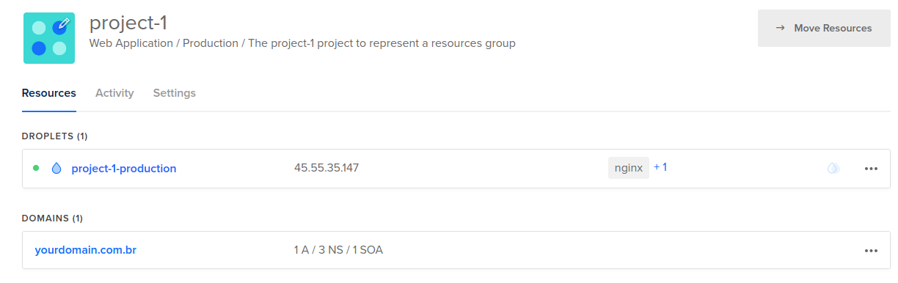
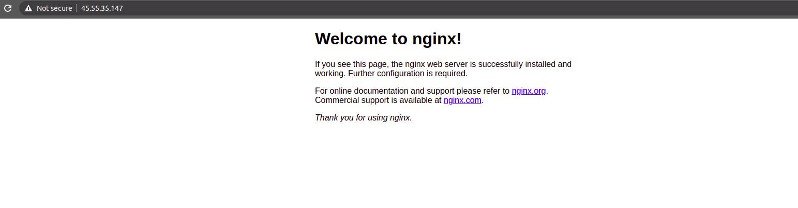
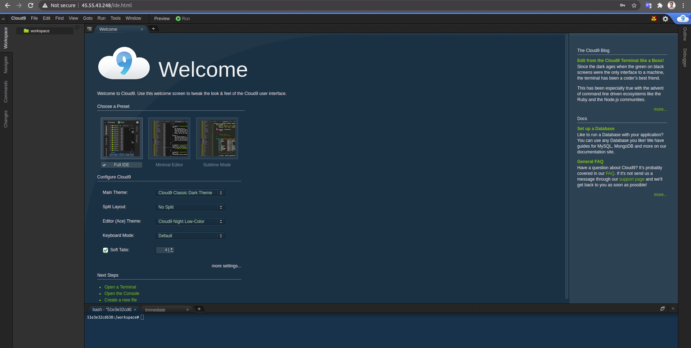

# p88

p88 é um projeto criado para trazer mais qualidade de vida
aos *devs*, principalmente os que tem vários projetos
e não aguentam mais ficar configurando cada deploy na mão. :raised_hands:

Utilizando o conceito de *infra as code*
cada *app* vai ter seus recursos como código,
tendo controle do que tem em cada VM e possibilitando
recriar os ambientes com pouco esforço usando
[Terraform](https://www.terraform.io)
e [Ansible](https://www.ansible.com).

O provedor que será utilizado é o
[DigitalOcean](https://www.digitalocean.com),
com máquinas a partir de $5/mês. :moneybag:

É como um piano de 88 teclas,
onde cada nota orquestrada de maneira controlada
soa em harmonia. :joy: :musical_keyboard: :notes:

## Requisitos

Para rodar esse projeto, vamos usar o 
[docker](https://docker.com)
com a imagem base `debian:stable-slim`. :whale2:

Vamos precisar de uma conta na 
[DigitalOcean](https://www.digitalocean.com)
e criar um *token* e um *fingerprint* para
interagir via API.
[Mais informações](https://docs.digitalocean.com/reference/api/create-personal-access-token)

## Apps

Os apps são as divisões de aplicativos,
podem ser considerados como um grupo para os
projetos, como um contexto.
Podendo separar por ambientes como:
`development`, `staging` e `production`.

No exemplo, vamos ter o `project-1`,
com dois ambientes `prod` e `staging`
e `project-2` com apenas `development`.

Veja como fica a divisão de pastas dentro do p88:

```bash
apps
├── project-1
│   ├── prod
│   │   ├── ansible
│   │   │   ├── ansible.cfg
│   │   │   ├── config.yml
│   │   │   └── playbook.yml
│   │   └── terraform
│   │       ├── locals.tf
│   │       ├── main.tf
│   │       └── variables.tf
│   └── staging
│       ├── ansible
│       │   ├── ansible.cfg
│       │   ├── config.yml
│       │   └── playbook.yml
│       └── terraform
│           ├── locals.tf
│           ├── main.tf
│           └── variables.tf
└── project-2
    └── development
        ├── ansible
        │   ├── ansible.cfg
        │   ├── config.yml
        │   └── playbook.yml
        └── terraform
            ├── locals.tf
            ├── main.tf
            └── variables.tf
```

Como exemplo ilustrativo, o `project-1` será um deploy
de uma imagem `nginx:stable-alpine`,
com a configuração de domínio.

No segundo `project-2`, será um ambiente de desenvolvimento
com a imagem do `sapk/cloud9:golang-alpine`.

### Terraform

O [Terraform](https://www.terraform.io) é responsável por interagir e provisionar usando os recursos no provedor
[DigitalOcean](https://www.digitalocean.com).
Como droplets, volumes, domain entre outros.

[Lista completa de recursos](https://registry.terraform.io/providers/digitalocean/digitalocean/latest/docs)

Para entender melhor, vamos dar uma olhada no arquivo `locals.tf`:
Esse arquivo é onde ficam as declarações da variáveis locais
que serão utilizadas para a criação dos recursos:

```
locals {
	env = "production"

	project = "project-1"
	project_purpose = "Web Application"
	domain = "yourdomain.com.br"
	droplet_image = "ubuntu-18-04-x64"
	droplet_region = "nyc3"
	droplet_size = "s-1vcpu-1gb"
	droplet_tags = ["nginx", "docker"]
}
```

No `main.tf`, são as definições dos recursos:

```
provider "digitalocean" {
  token = var.do_token
  version = "1.12.0"
}

module "droplet" {
  source = "/p88/lib/terraform/modules/droplet"

  name = local.project
  env = local.env
  region = "${local.droplet_region}"
  image = "${local.droplet_image}"
  size = "${local.droplet_size}"
  tags = "${local.droplet_tags}"
  user = "${local.droplet_user}"
  user_pvt_key = "${var.pvt_key}"
  ssh_fingerprint = "${var.ssh_fingerprint}"
}

module "domain" {
  source = "/p88/lib/terraform/modules/domain"

  domain = local.domain
  ipv4 = module.droplet.ipv4
}

module "project" {
  source = "/p88/lib/terraform/modules/project"

  name = local.project
  env = local.env
  purpose = local.project_purpose
  resources   = [
    "${module.droplet.urn}",
    "${module.domain.urn}",
  ]
}
```

Nesse exemplo, criamos uma *droplet*, um *domain*
e relacionamos os dois a um *project*.

### Ansible

O [Ansible](https://www.ansible.com) atua
na segunda etapa, depois que os servidores estão criados.
Ele será responsável em configurar as *droplets* na camada de configuração da máquina instalando os programas, dependencias e subindo as imagens docker.

Exemplo do `config.yml`:

```yml
all:
  hosts:
    104.236.36.162
  vars:
    app: project-1
    env: production
    image: nginx:stable-alpine
```

> O host `104.236.36.162` é o endereço ip da *droplet* que acabamos de criar usando o [Terraform](https://www.terraform.io). Atualize esse endereço correspondente ao servidor que deseja provisionar.

No arquivo `playbook.yml` ficam as
[roles](https://docs.ansible.com/ansible/latest/user_guide/playbooks_reuse_roles.html)
e tasks que vamos executar no provisonamento:

```yml
tasks:
  - name: Create container
    tags: app
    docker_container:
      name: "{{ app }}"
      image: "{{ image }}"
      state: started
      ports:
        - 80:80
```

Nesse exemplo do `project-1` foram instaladas duas *roles*,
[docker](https://github.com/geerlingguy/ansible-role-docker)
e [pip](https://github.com/geerlingguy/ansible-role-pip) para configurar a *droplet*.
Posteriormente baixando e criando o container
com a imagem `nginx:stable-alpine` disponível no
[Docker Hub](https://hub.docker.com/_/nginx).

Para mais informações sobre ansible playbook
[clique aqui](https://docs.ansible.com/ansible/latest/user_guide/playbooks_intro.html).

## Rodando o Projeto

Para rodar o projeto vamos precisar exportar o `token` e o
`fingerprint` criado no [DigitalOcean](https://www.digitalocean.com)
como variáveis de ambiente:

```bash
export do_token=<coloque-seu-token-aqui>
export do_fingerprint=<coloque-seu-fingerprint-aqui>
```

Para mais informações acesse de como criar o Access Token e configurar veja os links abaixo:
- [How to Create a Personal Access Token](https://www.digitalocean.com/docs/apis-clis/api/create-personal-access-token)
- [Terraform - Digital Ocean Provider](https://registry.terraform.io/providers/digitalocean/digitalocean/latest/docs)

Depois vamos construir a imagem docker do p88 com o terraform e
[Ansible](https://www.ansible.com)
para rodar os provisionamentos:

```bash
make build
```

> Feito isso já é possível provisionar o ambiente usando terraform e
[Ansible](https://www.ansible.com).

### Criando a infraestrutura com Terraform

Os comandos a baixo utilizam o terraform
para gerenciar a infraestrutura.

Para criar os recursos, execute:

```bash
make terraform-apply app=project-1 env=prod
```

Abrindo o [DigitalOcean](https://www.digitalocean.com),
podemos visualizar os recursos criados:


Se precisar destruir os recursos, execute:

```bash
make terraform-destroy app=project-1 env=prod
```

### Provisionando com o Ansible

Com a *droplet* criada vamos provisionar usando
[Ansible](https://www.ansible.com).

Para provisionar todo o ambiente do projeto, execute:

```bash
make ansible app=project-1 env=prod
```

Acessando o endereço ip da *droplet* já é possível acessar a aplicação:


Se precisar especificar uma task, utilize a variável `tags`,
conforme o exemplo a baixo:

```bash
make ansible app=project-1 env=prod tags=app
```

## Testando
Para verificar o funcionamento da *droplet*, entre o via `ssh <droplet-ip> -l root`
e liste os container em execução usando `docker ps`:

```bash
> ssh 45.55.35.147 -l root
root@project-1-production:~# docker ps
CONTAINER ID   IMAGE                 COMMAND                  CREATED          STATUS          PORTS                NAMES
863f134396b5   nginx:stable-alpine   "/docker-entrypoint.…"   47 seconds ago   Up 45 seconds   0.0.0.0:80->80/tcp   project-1
```

Acessando o `project-2` como um ambiente de dessenvolimento:

